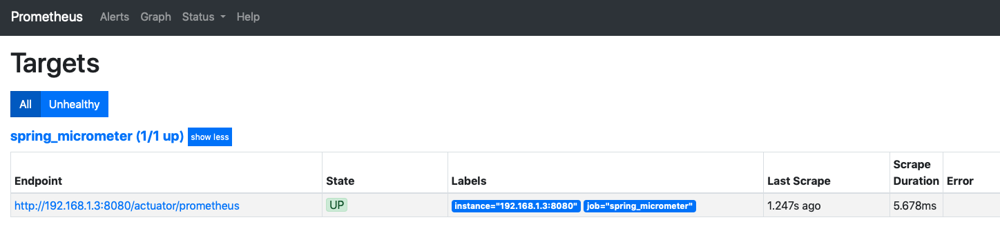
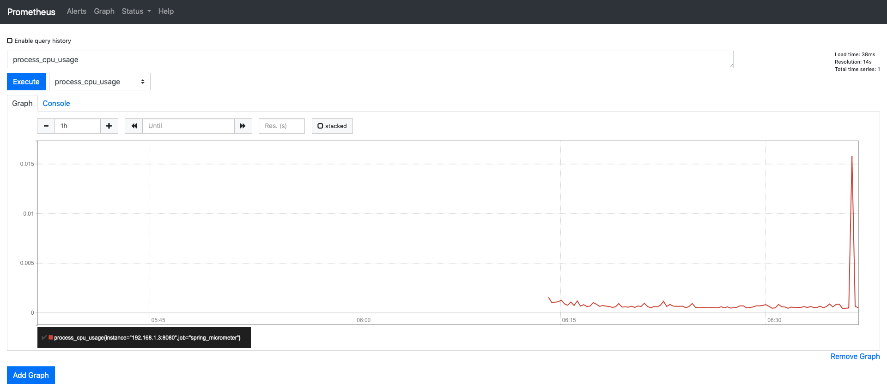
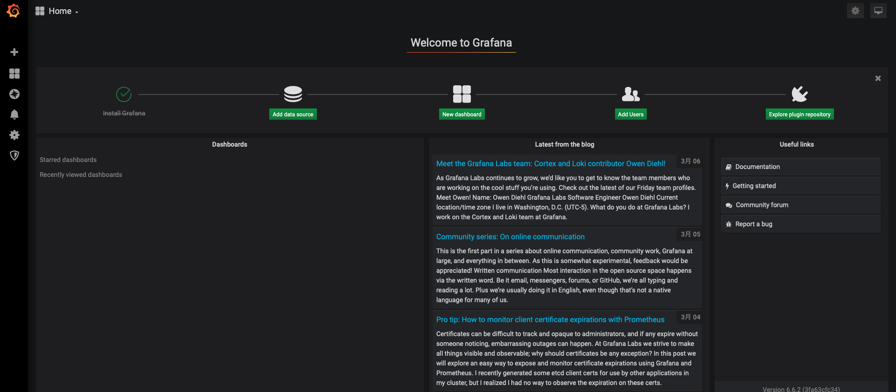

# Spring Observability Demo

- [Micrometer](https://micrometer.io)
- [Prometheus](https://prometheus.io/)
- [Grafana](https://grafana.com/docs/grafana/latest/)

## Description

## Demo

### 1. Spring Boot Actuator / Micrometer

Enable spring actuator endpoint on `application.yml`

- [Endpoints](https://docs.spring.io/spring-boot/docs/current/reference/html/production-ready-features.html#production-ready-endpoints)

```yaml
management:
  endpoints:
    web:
      exposure:
        include: "*"
```

You can see check application information exposed under default prefix `/actuator`

- http://localhost:8080/actuator

#### 1.1. Access Actuator Endpoint

```
$ curl -XGET http://localhost:8080/actuator | jq

{
  "_links": {
    "self": {
      "href": "http://localhost:8080/actuator",
      "templated": false
    },
    "beans": {
      "href": "http://localhost:8080/actuator/beans",
      "templated": false
    },
    "caches-cache": {
      "href": "http://localhost:8080/actuator/caches/{cache}",
      "templated": true
    },
  :
  :
    "metrics": {
      "href": "http://localhost:8080/actuator/metrics",
      "templated": false
    },
    "metrics-requiredMetricName": {
      "href": "http://localhost:8080/actuator/metrics/{requiredMetricName}",
      "templated": true
    },
    "scheduledtasks": {
      "href": "http://localhost:8080/actuator/scheduledtasks",
      "templated": false
    },
    "mappings": {
      "href": "http://localhost:8080/actuator/mappings",
      "templated": false
    }
  }
}
```

#### 1.2. Micrometer
Micrometer provides a vendor-neutral data provider, which exposes Actuator metrics to external sysytem such as Prometheus, Netflix Atlas and any more.

```gradle
dependencies {
	implementation("org.springframework.boot:spring-boot-starter-actuator")
	implementation("io.micrometer:micrometer-registry-prometheus:latest.release")
}
```

#### 1.3. Prometheus Endpoint for Actuator

```
$ curl -XGET http://localhost:8080/actuator|jq .[].prometheus

{
  "href": "http://localhost:8080/actuator/prometheus",
  "templated": false
}
```

### 2. Prometheus

Prometheus is a time-series database that stores the metric data by pulling it periodically over HTTP. It uses a built-in data scraper.

#### 2.1. Prometheus configuration on `prometheus.yml`

```yaml
scrape_configs:
  - job_name: 'spring_micrometer'
    metrics_path: '/actuator/prometheus'
    static_configs:
      - targets: ['127.0.0.1:8080']
```

Prometheus Container cannot access spring app address at local pc host. Because of it target address should be changed.

- `targets`
  - `$ ifconfig en0 | awk '/inet / {print $2}'`
  - `$ ipconfig getifaddr en0`

#### 2.2. Prometheus Container

```
$ docker run --rm -d \
--name=prometheus \
-p 9090:9090 \
-v (pwd)/prometheus.yml:/etc/prometheus/prometheus.yml \
prom/prometheus:v2.13.1 \
--config.file=(pwd)/prometheus.yml
```

```
$ open http://localhost:9090/targets
```



### 3. Grafana

Grafana offers a rich UI where you can build up custom graphs quickly. You can also import many community built dashboards.

#### 3.1. Grafana Container

```
$ docker run --rm -d \
--name=grafana \
-p 3000:3000 \
grafana/grafana:6.6.2
```

```
$ open http://localhost:3000
```


|Username|Password|
|--------|--------|
|admin|admin|



## Features

- feature:1
- feature:2

## Requirement

## Usage

## Installation

## Licence

Released under the [MIT license](https://gist.githubusercontent.com/shinyay/56e54ee4c0e22db8211e05e70a63247e/raw/34c6fdd50d54aa8e23560c296424aeb61599aa71/LICENSE)

## Author

[shinyay](https://github.com/shinyay)
